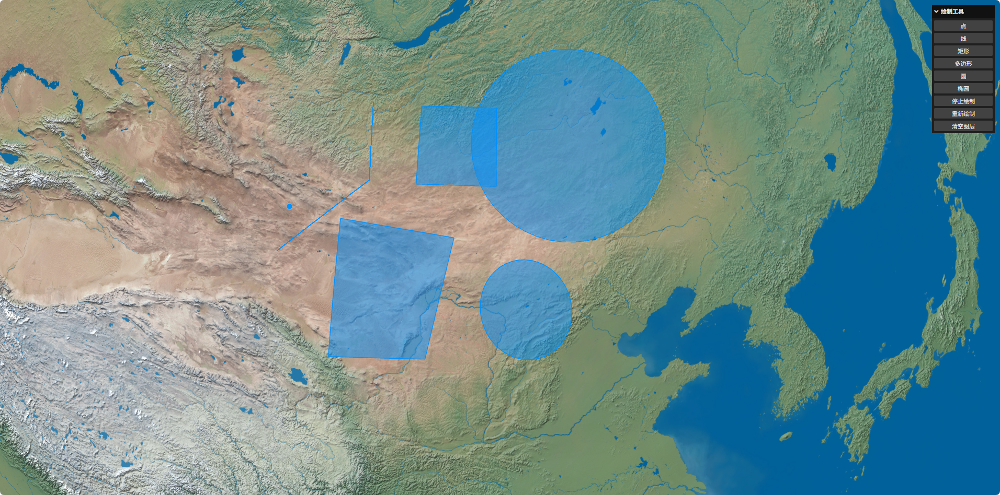

# Cesium DrawTool — Cesium 地图绘制工具

**在线访问地址：[xuzhoulong.github.io/cesium-draw/](https://xuzhoulong.github.io/cesium-draw/)**

> 基于 Cesium 的轻量级图形绘制与编辑工具库，支持画线、画点、画矩形、画多边形、画圆、画椭圆，绘制完成后可自由编辑（顶点拖拽 / 整体移动），并提供右键菜单、事件监听、停止/重新绘制等能力。**离线可用、零构建依赖、模块化易扩展。**

[中文](README.md) | [使用文档](docs/使用文档.md) | [开发文档](docs/开发文档.md)

---

## ✨ 功能特性

- 🗺️ **六种绘制类型**：线、点、矩形、多边形、圆、椭圆，面板一键切换
- ✏️ **编辑能力**：
  - 拖拽顶点修改形状（矩形对角联动，始终保持矩形）
  - 按住实体主体**整体拖拽移动**
  - 点击空白退出编辑、点击其他实体切换编辑
- 🖱️ **右键菜单**：开始编辑 / 停止编辑 / 删除实体
- 📡 **事件监听**：`editMovePoint`（编辑完点）、`editStop`（结束编辑），实时返回最新数据
- 🔁 **双模式调用**：回调（`success`）与异步（`Promise`）两种方式获取绘制结果
- 🏷️ **自定义实体 id**：绘制时传入 `id` 指定实体标识（冲突自动覆盖）
- 🛑 **绘制控制**：停止绘制（删除未完成实体）/ 重新绘制（清空重画）/ 清空图层
- 🎨 **样式可配**：默认样式 + 每次绘制的临时样式（线宽 / 颜色 / 点大小）
- 🚀 **离线可用**：内置离线 Cesium 与 lil-gui，无 CDN 依赖
- 🧩 **模块化设计**：每种绘制类型独立模块，扩展新类型只需 3 步

---

## 🖼️ 效果示意



```
线   ：左键加点 → 右键撤销 → 双击结束
矩形 ：两点对角，实时预览
多边形：单击加点 → 预览面实时闭合 → 双击定稿
编辑 ：拖顶点改形状 / 拖主体整体移动
```

---

## 🛠️ 技术栈

| 依赖                                         | 说明                               |
| -------------------------------------------- | ---------------------------------- |
| [Cesium](https://cesium.com/)                | 三维地球渲染（离线版 v1.140）      |
| [lil-gui](https://lil-gui.georgealways.com/) | 轻量控制面板（离线版 v0.19.1）     |
| 原生 JavaScript                              | ES Module，无构建工具、无 npm 依赖 |

---

## 🚀 快速开始

### 环境要求

浏览器通过**本地静态服务器**访问（ES Module 不支持 `file://` 直接打开）。

### 1. 启动项目

```bash
# 项目根目录启动静态服务
http-server
# 浏览器访问 http://localhost:8080
```

打开即可使用右侧面板绘制。

### 2. 集成到你的项目

```js
import Draw from "./js/drawTool.js";
import initGui from "./js/gui.js";

const viewer = new Cesium.Viewer("map", {
  baseLayer: false, // 关闭默认底图（避免 token 报错）
  baseLayerPicker: false,
  infoBox: false,
  selectionIndicator: false,
});
// 添加 XYZ 底图（示例：高德路网）
viewer.imageryLayers.addImageryProvider(
  new Cesium.UrlTemplateImageryProvider({
    url: "https://webrd04.is.autonavi.com/appmaptile?lang=zh_cn&size=1&scale=1&style=7&x={x}&y={y}&z={z}",
  }),
);

// 创建绘制工具实例
const draw = new Draw(viewer, {
  enableEdit: true, // 是否支持编辑（默认 true）；false 时禁用所有编辑入口，autoEdit 随之失效
  autoEdit: true, // 绘制完自动进入编辑（默认 true）
  style: { lineWidth: 2, color: "#0092ff", pointSize: 10 }, // 默认样式
});

// 创建 lil-gui 面板（右上角按钮组）
initGui(draw, viewer);
```

---

## 📖 使用说明

### 面板按钮

**点 / 线 / 矩形 / 多边形 / 圆 / 椭圆 / 停止绘制 / 重新绘制 / 清空图层**

### 绘制交互

| 类型   | 交互                               | 完成       |
| ------ | ---------------------------------- | ---------- |
| 线     | 单击加点，右键删点（虚线实时重绘） | 双击结束   |
| 点     | 鼠标移动预览                       | 单击放置   |
| 矩形   | 两点对角，预览实时跟随             | 第二点点击 |
| 多边形 | 单击加点，预览面实时闭合，右键删点 | 双击闭合   |
| 圆     | 第一点圆心、第二点半径点           | 第二点点击 |
| 椭圆   | 圆心 → 长半轴点 → 短半轴点         | 第三点点击 |

### 编辑操作

| 操作             | 行为                             |
| ---------------- | -------------------------------- |
| 按住顶点拖动     | 修改顶点（矩形对角联动保持矩形） |
| 按住实体主体拖动 | **整体移动**                     |
| 点击空白         | 退出编辑                         |
| 点击其他实体     | 切换编辑                         |
| 右键实体         | 菜单：开始编辑 / 停止编辑 / 删除 |

---

## 📡 获取绘制结果

### 回调 / Promise

```js
// 回调方式
draw.startDraw({
  type: "line",
  id: "myLine",
  style: { color: "#ff0000" },
  success: (result) => console.log(result.id, result.positions, result.type),
});

// 异步方式
const result = await draw.startDraw({ type: "rect" });
// result = { id, positions, type }
```

### 事件监听

```js
// 编辑完一个点（拖拽松手）
draw.on("editMovePoint", (data) => console.log("编辑完点", data));

// 结束编辑
draw.on("editStop", (data) => console.log("结束编辑", data));

// 移除监听
draw.off("editMovePoint", handler);
```

> `positions` 为**实时引用**，编辑后直接读取即最新坐标（矩形返回推导的 4 角点）。

---

## ⚙️ 配置项

### Draw 实例

```js
new Draw(viewer, {
  enableEdit: true, // 是否支持编辑（默认 true）；false 时点击 / 右键菜单 / 自动编辑全部禁用，仅保留删除
  autoEdit: false, // 绘制完是否自动进入编辑（默认 true）
  style: {
    lineWidth: 2, // 线宽
    color: "#0092ff", // 颜色（线/面/点）
    pointSize: 10, // 点大小
  },
});
```

### startDraw

```js
draw.startDraw({
  id: "customId",               // 自定义实体 id（不传自动生成；传了覆盖同 id 旧实体）
  type: "circle",               // line / point / rect / polygon / circle / ellipse
  style: { color: "#00ff00" },  // 本次样式，覆盖默认
  success: (result) => { ... }, // 可选（与 Promise 二选一）
});
```

---

## 📁 目录结构

```
cesium_draw/
├── index.html                 # 页面入口
├── js/
│   ├── drawTool.js            # 核心类（公共方法 / 事件 / 分发 / 编辑 / 菜单）
│   ├── drawActions.js         # 动作层转发
│   ├── gui.js                 # lil-gui 面板
│   └── modules/               # 各绘制类型独立模块
│       ├── drawLine.js
│       ├── drawPoint.js
│       ├── drawRect.js
│       ├── drawPolygon.js
│       ├── drawCircle.js
│       └── drawEllipse.js
├── docs/
│   ├── 使用文档.md            # 用户使用指南
│   └── 开发文档.md            # 架构 / API / 扩展 / 避坑
└── libs/
    ├── Cesium/                # 离线 Cesium
    └── lil-gui.js             # 离线 lil-gui
```

---

## 🧩 扩展开发

新增绘制类型（如三角形）只需 3 步：

1. **新建模块** `js/modules/drawTriangle.js`，默认导出 `(ctx, options)`，完成时调用 `ctx.completeShape(shape)`
2. **注册**：`js/drawTool.js` 引入模块、加委托方法、`startDraw` 分发加 `"triangle"` 分支
3. **加按钮**：`js/gui.js` 添加按钮（`drawActions.js` 已统一 type 分发）

编辑能力（顶点拖拽 / 整体移动 / 右键菜单 / 事件）**自动复用**。

> 详细开发指南与避坑记录见 [开发文档](docs/开发文档.md)。

---

## 📚 文档

- [使用文档](docs/使用文档.md) — 完整使用说明、交互规则、常见问题
- [开发文档](docs/开发文档.md) — 架构分层、API、扩展步骤、开发避坑记录

---

## 🤝 贡献

欢迎提交 Issue 与 PR，建议先阅读 [开发文档](docs/开发文档.md) 了解模块约定。

---

## 📄 License

MIT
